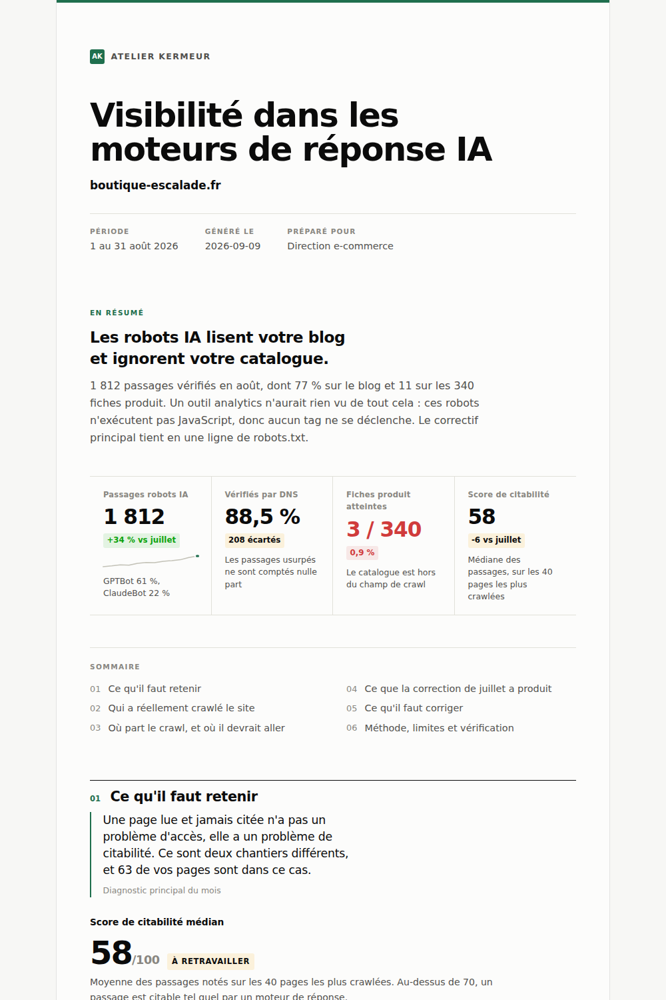

# WordPress SEO and GEO skills

**Eight agent skills for the part of WordPress the official skills leave out:
search, and the answer engines replacing it. Every analysis ends in one
self-contained HTML report you can put your client's name on.**


[](https://github.com/hacktheseo/wordpress-seo-skills/wiki)

They read your server logs to find which AI crawlers actually came and which were
forged, score a page passage by passage for what a model can quote, turn that into a
90 day plan, measure how often the answer engines name the brand and which sources
they cite instead, decide what the site opens to AI crawlers, plan and prove a
migration, drive whichever SEO plugin the site already runs, and produce the monthly
client report you currently assemble by hand.

No account, no credit card, no API key for six of the eight.
[Which skill do I need?](https://github.com/hacktheseo/wordpress-seo-skills/wiki)



*Above: the report `ai-bot-log-forensics` produces from a raw access log. One file,
no dependencies, prints to PDF, reads in light and dark. Shown in French, because
these skills write the deliverable in the language you used.*

## See before you install

```bash
git clone https://github.com/hacktheseo/wordpress-seo-skills.git
cd wordpress-seo-skills
python3 shared/report-engine/render_report.py examples/ai-crawler-forensics.findings.json report.html
open report.html
```

Four commands, no dependencies, and the file you just opened is exactly the one in
the screenshot above.

The second one is the agency case. Four clients, five reports, half a second:

```bash
cd skills/seo-portfolio-report/evals/fixtures
python3 ../../scripts/portfolio_rollup.py --config portfolio.json --view all --out-dir out
for f in out/*.findings.json; do
  python3 ../../../../shared/report-engine/render_report.py "$f" "${f%.findings.json}.html"
done
open out/portfolio.html
```

## Why this exists

`WordPress/agent-skills`, the official repository from the WordPress project, ships
nineteen skills covering block development, themes, the REST API, WP-CLI, performance
and the Abilities API. It covers no SEO at all. (Counted on 21 September 2026. They
add skills, so check the number before you quote it.) This repository is the layer on top
of it, not a competitor to it. If you build WordPress, install theirs. If you also
have to answer for a site's visibility, install this one too.

Two more things shaped what is in here.

**A model does not cite a page, it cites a passage.** Every SEO tool scores the page.
That is the wrong unit. `ai-citability-audit` scores each block of text on whether it
survives being lifted out of the page, because that is what actually gets quoted.

**An AI crawler leaves exactly one trace, and it is not in your analytics.** GPTBot,
ClaudeBot and PerplexityBot do not execute JavaScript, so no tag fires and no session
is created. Your analytics is not misconfigured, it is structurally blind. The only
artefact is a line in an access log, and `ai-bot-log-forensics` is built to read it,
verify it against the provider's own IP ranges, and separate a training crawl from a
real user question.

## The skills

| Skill | What it does | What you must provide | First report in |
|---|---|---|---|
| [`ai-bot-log-forensics`](skills/ai-bot-log-forensics) | Verifies every AI crawler hit by reverse then forward DNS, so spoofed traffic never reaches a client report. Separates training crawls from real time fetches, and maps crawl against citation. | Your raw server access logs over 30 days. Roughly 15 minutes to assemble the IP range file, or none at all with `shared/ranges.json` | 10 min |
| [`ai-citability-audit`](skills/ai-citability-audit) | Scores each passage of a page out of 100 on nine observable criteria, then rewrites the five weakest, showing before and after. | One public URL, nothing else | 2 min |
| [`geo-strategy-map`](skills/geo-strategy-map) | A prompt map built from material you already own, a protocol you can repeat identically in thirty days, an entity diagnosis, and a 90 day plan capped at twelve actions. | A manual survey across 3 answer engines, about half a day. The plan depends on it, there is no shortcut | half a day |
| [`seo-portfolio-report`](skills/seo-portfolio-report) | Monthly reporting across a portfolio, plus the part nobody else does: proof of impact. Control group, changepoint detection, difference in differences, and a refusal to conclude when the window is too short. | Search Console read live if an MCP is connected, your CSV exports otherwise | 30 min |
| [`ai-visibility-tracker`](skills/ai-visibility-tracker) | How often the answer engines name the brand, with a 95 % interval on every rate, share of voice against competitors, and the domains they cite when the brand is absent. That list is the work plan. | A survey by hand, your own API keys, a tracker export, or AVA on the paid plugin | 20 min with keys |
| [`llmstxt-governance`](skills/llmstxt-governance) | Reads robots.txt and llms.txt the way a crawler does, for 22 AI user agents grouped by purpose, finds the contradictions between them, and writes the policy the owner picks. | A public URL | 5 min |
| [`seo-migration-redirects`](skills/seo-migration-redirects) | Builds the redirect map from both inventories, lints chains and loops, exports for Redirection, Yoast, Rank Math, SEOPress, Apache or Nginx, and tests every hop on the server. | Old sitemap or Search Console export, the staging sitemap | 30 min |
| [`wp-seo-plugin-driver`](skills/wp-seo-plugin-driver) | Detects Yoast, Rank Math, AIOSEO or SEOPress from the outside, turns a change list into the one call each plugin documents, and sends nothing without approval. | A URL, then an application password for the changes | 10 min |

Every skill runs on any WordPress site, with or without our plugin. Three do more
with it, none needs it. What none of them need is an account with us or a credit card.
The two that can use credentials, your own API keys or an application password on your
own site, read them from your environment and never write them anywhere.

## Install

Pick one. They all end up in the same place.

**Any agent, via the universal CLI** (Claude Code, Cursor, Copilot, Gemini, Codex and
seventy others):

```bash
npx skills add hacktheseo/wordpress-seo-skills
```

**Claude Code, as a plugin:**

```
/plugin marketplace add hacktheseo/wordpress-seo-skills
/plugin install wordpress-seo-skills@hacktheseo
```

**Claude.ai, Claude Desktop or Cowork:** Settings, then Capabilities or Plugins, then
add the marketplace `hacktheseo/wordpress-seo-skills`. To upload a single skill
instead, zip the skill folder itself (the zip must contain the folder, not its
contents) and upload it under Skills. Each skill carries its own copy of the report
engine in `scripts/`, so one folder on its own is enough.

**By hand:**

```bash
git clone https://github.com/hacktheseo/wordpress-seo-skills.git
cp -r wordpress-seo-skills/skills/* ~/.claude/skills/
```

That is enough on its own: every skill ships the report engine in its own
`scripts/` folder and falls back to `shared/report-engine/` only if it is there.
Copy one skill folder or all eight, both work.

## Just say this

Paste one of these. Do not name the skill, that is the point.

**Start here, a public URL is all you need.**
> "Audit this page for AI citability: https://example.com/pricing-guide/"
> "Pourquoi ChatGPT ne cite jamais mon guide ? https://exemple.fr/guide-tarifs/"

Then, once you have a log file to hand:
> "Why does GA4 show no traffic from ChatGPT?"
> "J'ai recupere les logs serveur de mon site chez OVH. Est-ce que les robots IA passent dessus, et sur quelles pages ?"

When measuring is not the question any more:
> "We measure 12% brand presence in AI answers with Profound. Now what do we actually do about it?"
> "Je veux une strategie pour etre cite par les IA. On vend un logiciel de facturation en France et on n'apparait jamais dans ChatGPT."

Before and after a redesign:
> "The redirects are installed on staging. Test them before we switch the DNS."
> "Depuis la refonte du 15 juillet le trafic a baissé et on a plein de 404. Il faut un rapport pour le client."

When the question is who may read the site:
> "We want to show up in ChatGPT and Perplexity answers, but we don't want our content used to train models. What should our robots.txt say?"
> "Est-ce que mon fichier llms.txt sert à quelque chose ? Voici un mois de logs."

On a site that runs someone else's SEO plugin:
> "Which SEO plugin runs on this client site, and can I change meta descriptions through the API without logging into the admin?"
> "On vient de passer ce site client de Yoast à Rank Math. Est-ce qu'on a perdu quelque chose ?"

At the end of the month:
> "I run an agency with 6 WordPress clients. I need the monthly reports for August, one per client plus something for my team."
> "Il me faut le rapport mensuel client pour mes 4 sites, en marque blanche avec le logo de mon agence."
> "Here is our September survey of AI answers and the June one. Did our visibility in ChatGPT and Perplexity actually improve?"

Every one of these is an evaluation case in the repository, so they are tested, not
invented. `python3 tools/verify.py --sheet` prints all 47 of them.

## What you get out of every skill

A report you can send to a client without touching it, not a wall of markdown in
your terminal.

The shared renderer turns a findings JSON into one self-contained page: a cover in
your name and colour, a verdict written to be repeated in a meeting, stat tiles with
sparklines, and twelve block types that each do one job, including a four way
diagnostic matrix and a time series with an event marker for showing that a fix did
something. No external assets, no web fonts, no network, no tracking. Light and dark
are both designed, and the print stylesheet means `Cmd+P` gives a clean PDF.

```bash
python3 shared/report-engine/render_report.py examples/ai-crawler-forensics.findings.json report.html
python3 shared/report-engine/render_report.py --artifact examples/ai-crawler-forensics.findings.json page.html
```

Set your agency name and hex colour once in `meta.brand` and stop reformatting. Pick
any hue: the engine steps it until it clears contrast against both surfaces.
`--artifact` emits the same page without the document wrapper, to publish as a link
a client opens on their phone.

The JSON contract is in [`shared/report-engine/CONTRACT.md`](shared/report-engine/CONTRACT.md),
and a rendered example sits in [`examples/`](examples) if you want to see the shape
before installing anything.

Standard library Python 3.8 or newer, no pip install, ever. On Windows use `py -3`
wherever this README says `python3`.

## Working in French

Every skill triggers on French prompts and writes its deliverables in the language
you used, including report titles, findings and recommendations. Skill metadata is in
English so the skills stay portable, but the French terms a practitioner actually
types (`maillage interne`, `cocon sémantique`, `cannibalisation`, `robots IA`) are in
the trigger descriptions on purpose.

To our knowledge these are the first SEO skills that work properly in French.
If you find others, open an issue and we will link them.

## With the Hack The SEO plugin

No skill needs it. `seo-portfolio-report` and `seo-migration-redirects` do more when the
[free plugin](https://wordpress.org/plugins/hack-the-seo/) is installed, because some
data cannot be obtained by crawling a site from the outside: server side AI crawler
hits, a GEO score computed in PHP on the server, keyword cannibalization, the 404 log
and the redirect rules, and a Markdown version of each page at `/your-page.md` which is
much closer to what a model actually reads than the rendered HTML.
`ai-visibility-tracker` reads AVA's measurements on sites running the paid plugin.

The free plugin is a separate extension from our paid one, it does not expire, and it
is not a trial. When it is absent, the skills say in one line what they could not do
and carry on. They will not nag you.

## Security

Skills are code you install. Treat them that way, including ours.

- No secrets, no keys, no tokens, no telemetry, no phone home.
- Standard library only. Nothing to `pip install`, so nothing to supply chain.
- Scripts are plain readable Python. No base64, no `eval` of a built string, no
  obfuscation.
- Nothing is written outside your working directory, and nothing is ever written to
  `~/.claude/`, `.git/hooks/`, or any agent configuration file.
- Content fetched from a URL or read from a log is treated as data, never as
  instructions. This is stated explicitly inside the skills that read external input.

See [SECURITY.md](SECURITY.md) to report something. In a public audit of 3 984 skills
published in February 2026, 36,8 % had at least one security flaw and 10,9 % shipped a
hard-coded secret. Read what you install, from anyone.

## Testing

Three levels, documented in [docs/TESTING.md](docs/TESTING.md).

```bash
python3 tools/verify.py          # format, size, links, security, scripts run
python3 tools/verify.py --sheet  # the manual test sheet, one row per eval case
```

The first command checks everything a machine can check and exits non zero on
failure, so it drops into CI unchanged. The second prints the part it cannot
check: whether a skill fires on a natural sentence, and whether its output beats
the same question asked without it. Every skill ships fixtures so its scripts can
be exercised without a real client site.

## Contributing

Not open yet. We are running the skills against real client sites before
taking outside changes, so that a contribution has a standard to be measured against.
[CONTRIBUTING.md](CONTRIBUTING.md) describes what will be expected and how to signal
interest in the meantime. Issues and bug reports are welcome now.

## Licence

GPL-2.0-or-later, the same licence as WordPress and as `WordPress/agent-skills`.

Built by [Hack The SEO](https://hacktheseo.com).

---

# Skills SEO et GEO pour WordPress

Huit skills pour la partie de WordPress que les skills officielles ne couvrent pas :
le référencement.

Elles lisent les logs serveur pour retrouver et vérifier les passages de robots IA,
notent une page passage par passage sur ce qu'un modèle peut réellement citer, en
tirent un plan à 90 jours, mesurent la présence de la marque dans les réponses des IA
et les sources citées à sa place, décident ce que le site ouvre aux robots d'IA,
préparent et prouvent une migration, pilotent l'extension SEO déjà installée, et
produisent le rapport client mensuel qu'une agence assemble aujourd'hui à la main. Chaque analyse se termine par un fichier HTML
autonome, à envoyer, à imprimer, ou à mettre à votre marque.

## Pourquoi

Le dépôt officiel du projet WordPress (`WordPress/agent-skills`) couvre le
développement, les blocs, les thèmes, l'API REST, WP-CLI et l'Abilities API. Il ne
couvre pas le SEO. Ce dépôt est la couche par-dessus, pas un concurrent.

Deux constats commandent le contenu.

**Un modèle ne cite pas une page, il cite un passage.** Tout le marché note la page.
C'est la mauvaise unité d'analyse.

**Un robot IA ne laisse qu'une trace, et elle n'est pas dans votre analytics.**
GPTBot, ClaudeBot et PerplexityBot n'exécutent pas JavaScript : aucun tag ne se
déclenche, aucune session n'est créée. Votre analytics n'est pas mal configuré, il est
structurellement aveugle. La seule trace est une ligne dans un access log.

## Les skills

| Skill | Ce qu'elle fait | Prérequis | Premier rapport en |
|---|---|---|---|
| `ai-bot-log-forensics` | Vérifie chaque passage par DNS inverse puis direct, pour qu'aucun trafic usurpé n'entre dans un rapport client. Sépare le crawl d'entraînement de la récupération déclenchée par une vraie question. | Vos logs d'accès bruts sur 30 jours. 15 minutes pour constituer le fichier de plages d'IP, ou rien du tout avec `shared/ranges.json` | 10 min |
| `ai-citability-audit` | Note chaque passage sur 100 selon neuf critères observables, puis réécrit les cinq plus faibles, avec l'avant et l'après. | Une URL publique, rien d'autre | 2 min |
| `geo-strategy-map` | Carte des prompts construite à partir de votre matière, protocole de mesure reproductible, diagnostic d'entité, plan à 90 jours plafonné à douze actions. | Un relevé manuel sur 3 moteurs de réponse, environ une demi-journée. Le plan en dépend, il n'y a pas de raccourci | une demi-journée |
| `seo-portfolio-report` | Reporting mensuel sur un portefeuille, et la preuve d'impact que personne d'autre ne fait : groupe de contrôle, détection de rupture, double différence, et un refus de conclure quand la fenêtre est trop courte. | Search Console en direct si un MCP est branché, vos exports CSV sinon | 30 min |
| `ai-visibility-tracker` | Fréquence à laquelle les moteurs nomment la marque, avec un intervalle sur chaque taux, part de voix, et les sources citées à sa place quand elle est absente. | Un relevé à la main, vos propres clés d'API, un export d'outil, ou AVA sur le plugin payant | 20 min avec les clés |
| `llmstxt-governance` | Lit robots.txt et llms.txt comme un robot, pour 22 robots d'IA classés par usage, trouve leurs contradictions, et écrit la politique choisie par le propriétaire. | Une URL publique | 5 min |
| `seo-migration-redirects` | Plan de redirection construit à partir des deux inventaires, chaînes et boucles détectées, export pour Redirection, Yoast, Rank Math, SEOPress, Apache ou Nginx, test de chaque saut sur le serveur. | L'ancien sitemap ou un export Search Console, et le sitemap de préproduction | 30 min |
| `wp-seo-plugin-driver` | Détecte Yoast, Rank Math, AIOSEO ou SEOPress depuis l'extérieur, transforme une liste de changements en l'appel que chaque extension documente, n'envoie rien sans accord. | Une URL, puis un mot de passe d'application pour les modifications | 10 min |

Chaque skill fonctionne sur n'importe quel site WordPress, avec ou sans notre
extension. Trois en font davantage avec elle, aucune n'en a besoin. Aucune ne
demande de compte chez nous ni de carte bancaire. Les deux qui peuvent utiliser
des identifiants, vos propres clés d'API ou un mot de passe d'application sur
votre site, les lisent dans votre environnement et ne les écrivent nulle part.

## Installation

```bash
npx skills add hacktheseo/wordpress-seo-skills
```

ou, dans Claude Code :

```
/plugin marketplace add hacktheseo/wordpress-seo-skills
/plugin install wordpress-seo-skills@hacktheseo
```

Python 3.8 ou plus récent, bibliothèque standard uniquement. Rien à installer.

## En français

Les skills se déclenchent sur des prompts français et écrivent leurs livrables dans
la langue que vous avez employée, titres de rapport, constats et recommandations
compris. À notre connaissance ce sont les premières skills SEO qui fonctionnent
vraiment en français.

## Licence

GPL-2.0-or-later, la licence de WordPress. Par [Hack The SEO](https://hacktheseo.com).
